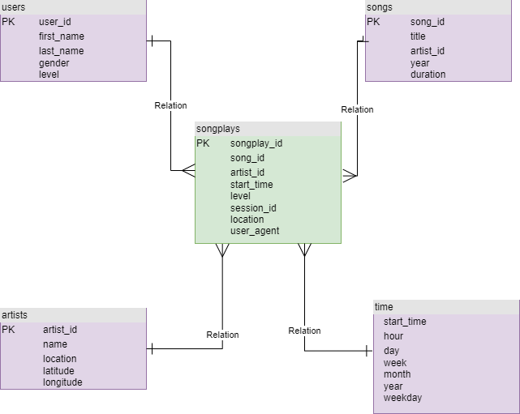

# Data Modeling With Postgres

The purpose of this project is to create database to store data from JSON format, we will normalize and denormolaize schema to store songs data from JSON. There is existing pipeline to transform data from JSON to Postgres DB.

## How to run the Python scripts

Open terminal

### Run python script to create database and tables

`python3 create_tables.py`

Once run that file the database sparkifydb will be created, the tables such as songplays, users, songs, artists, time will be created as well. The script also delete database if exists and all tables if exists as well.

### Run python script to execute ETL

`python3 etl.py`

Once run that file successfully, All JSON data will be loaded into Postgres DB. JSON song files are from `data/song_data` and JSON log files are from `data/log_data`.

## Database schema design

## Example queries for song play anlysis

Count number of songs in database

`SELECT count(*) FROM songs`

Count number of Artist in datbase

`SELECT count(*) FROM artists`
